# AnaLoc - Streaming and Batch Sensor Data Analysis
<sup><sub>Authors: [Yong Wu](https://github.com/wustudent), [Hai Dinh Tuan](https://github.com/haidinhtuan), [Felix Beierle](https://github.com/fbeierle)</sup></sub>

AnaLoc is a sensor data analysis software package by TU-Berlin SNET, developed in the context of IC4F.

You can find our related publication "Secure Real-time Communication and Computing Infrastructure for Industry 4.0 — Challenges and Opportunities" here: https://ieeexplore.ieee.org/document/8854499

---

Table of contents of this README:

1. [Development environment setup and running the code](#1-development-environment-setup-and-running-the-code)
2. [Testing](#2-testing)
3. [Module descriptions and deployment configurations](#3-module-descriptions-and-deployment-configurations)
4. [Interfaces](#4-interfaces)

---

## 1. Development environment setup and running the code

### 1.1. Install and run *docker*

We use docker and docker-compose for the deployment. **Docker Toolbox** is recommended for **Windows** because of the firewall problem.
Follow these steps to **install** and **start** docker:<br>
[Docker for Windows](https://docs.docker.com/docker-for-windows/install/)<br>
[Docker for MacOS](https://docs.docker.com/docker-for-mac/install/)<br>

If you have problem with the firewall on **Windows**, install **Docker Toolbox** instead<br>
[Docker Toolbox for Windows](https://docs.docker.com/toolbox/toolbox_install_windows/)<br>
[Docker Toolbox for MacOS](https://docs.docker.com/toolbox/toolbox_install_mac/)<br>

If you decided to install **Docker for Windows**, please make sure the Hyper-V feature of Windows is available before you install.
And after you installed **Docker for Windows**, please open `Settings` of Docker for Windows and then check the check box as shown in this picture:
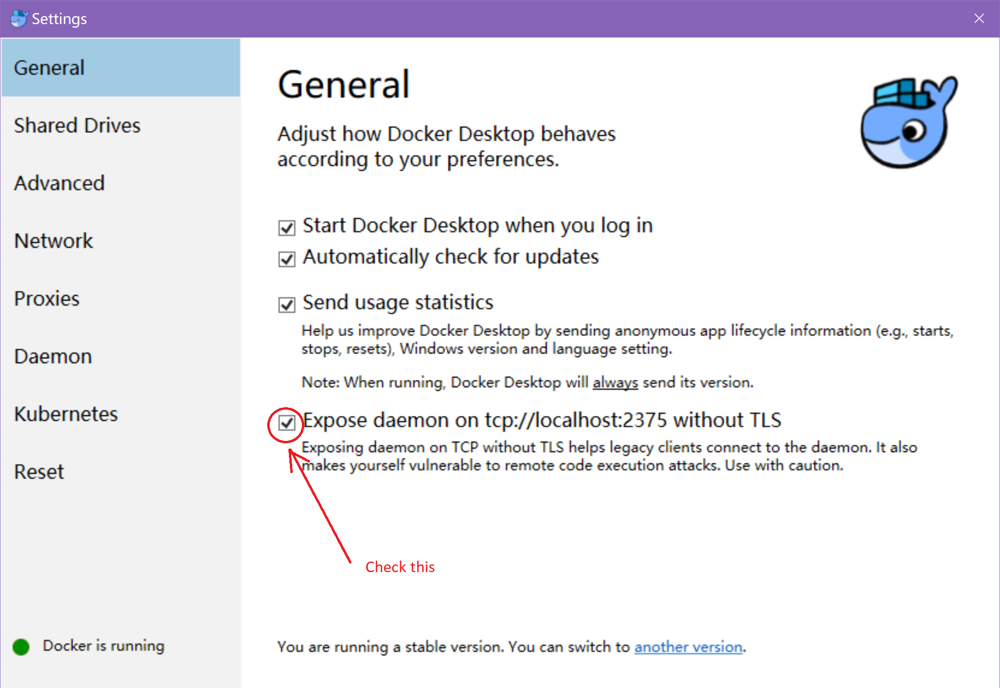

run command in terminal to make sure docker and docker-compose is installed correctly:
```sh
docker -v
docker-compose -v
```
Double click on Docker or Docker Quickstart Terminal to make docker run.

### 1.2. Install *IntelliJ IDEA* and *Maven*

If you are using windows, please install **Maven** first!
Follow the steps in this page to download and install Maven:<br>
[Download Maven](https://maven.apache.org/download.cgi)<br>
[Install Maven](https://maven.apache.org/install.html)<br>
Use this command to make sure maven is installed correctly:
```cmd
mvn -v
```

We use **IntelliJ IDEA** as IDE to develop, it is recommended to use the same environment for debugging.
Follow the steps in this page to download and install IntelliJ IDEA:<br>
[Download IntelliJ IDEA](https://www.jetbrains.com/idea/download/)<br>

It is also recommended to use the **Docker integration** Plugin in the **IntelliJ** IDE,
follow these steps to install:

1. click "File"->"Settings" for **Windows** version or "IntelliJ IDEA"->"Preferences..." for **Mac** version.
2. In "Plugin" search for "Docker integration": <br/> 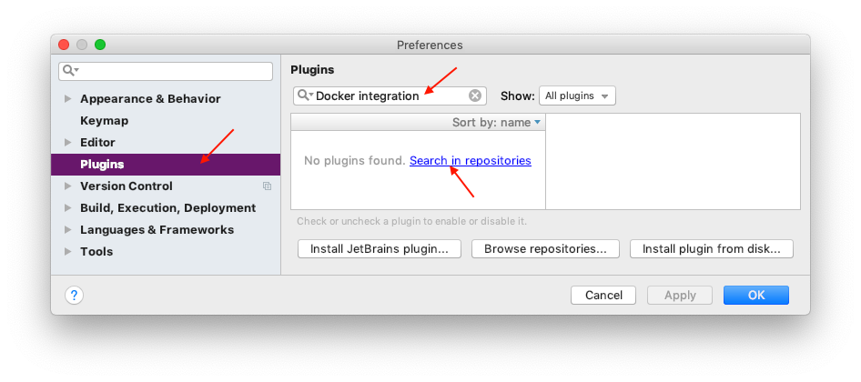
3. In the pop up window select install and then restart IntelliJ: <br/>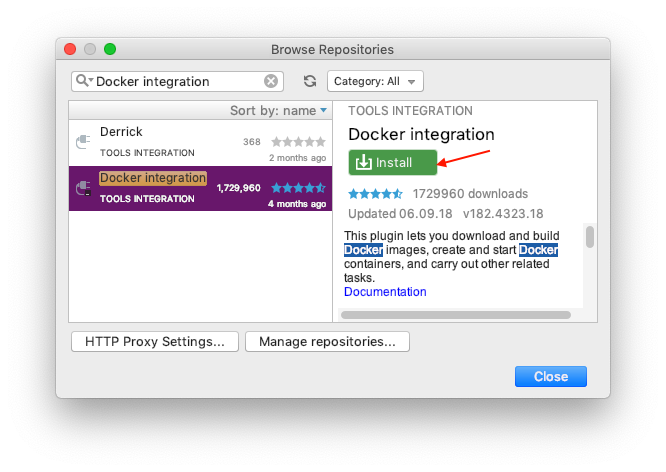

### 1.3. Install *Git* and clone this project

Follow the steps in this page to download and install Git:
[Download link](https://git-scm.com/downloads)<br>

Use `git clone {path}` to clone this project.

### 1.4. Open Analoc with IntelliJ IDEA
Drag `pom.xml` to maven project tab
then execute maven install

### 1.5. Build the code and Docker images
For Mac:
```sh
./rebuild.sh
```

For Windows:
```cmd
rebuild.cmd
```

### 1.6. Deploy the Docker images
Use this command to deploy:
```sh
docker-compose -p AnaLoc up
```
or use the bash script `./deploy.sh`

If you want to stop the cluster:
```sh
docker-compose -p AnaLoc down -v
```
or use the bash script `./stop.sh`

---

## 2. Testing

### 2.1 Monitor the service status
Open your web browser and go to [http://localhost:8888](http://localhost:8888) to see the service health states.<br>
If you are using Docker Toolbox on Windows, you may need to goto [http://192.168.99.100:8888](http://192.168.99.100:8888) instead.

You can see the console of different containers clearly with the IntelliJ **Docker integration** Plugin. To run it, do as follows:
<br/>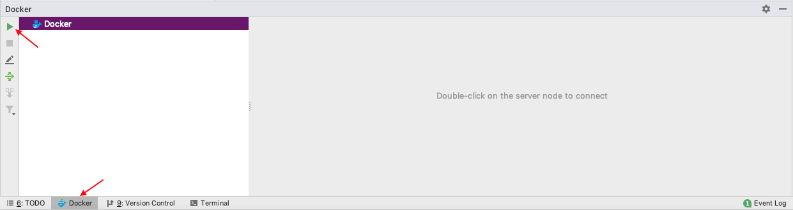


### 2.1 Running manual stream analysis tests
* Paho Tool for streaming result validation
After deploy, use [MQTT debug tool](https://www.eclipse.org/downloads/download.php?file=/paho/1.0/org.eclipse.paho.mqtt.utility-1.0.0.jar)
connect to `127.0.0.1:1883`  or `192.168.99.100:1883` and subscribe topic `/warning/area` and `/warning/speed`,
then open Intellij IDEA IDE, run `/tools/src/main/java/ArenaMqttEmulator.java` , enter `arena2036MQTTshuttle` as filename, press enter.
You can see the warning data points from the debug tool: <br>
**If you are using Docker Toolbox on Windows, you may need to pair port 1883 to localhost manually in Virtual Box when you want to use localhost.**<br>
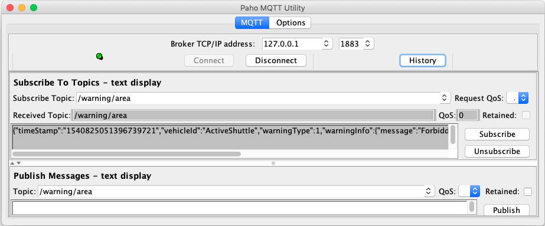 <br> 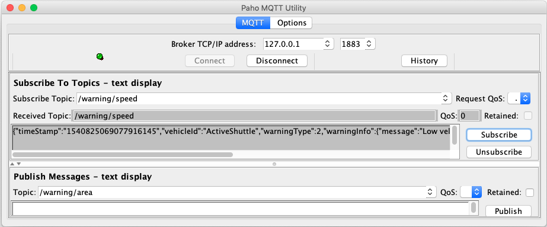<br>
There are **2** types of warning, details see Section 4.


### 2.2 Running manual batch analysis tests

* Front-end / Postman for batch job validation
After deploy, go to `127.0.0.1:8222` or `192.168.99.100:8222`, you will see the following heatmap:
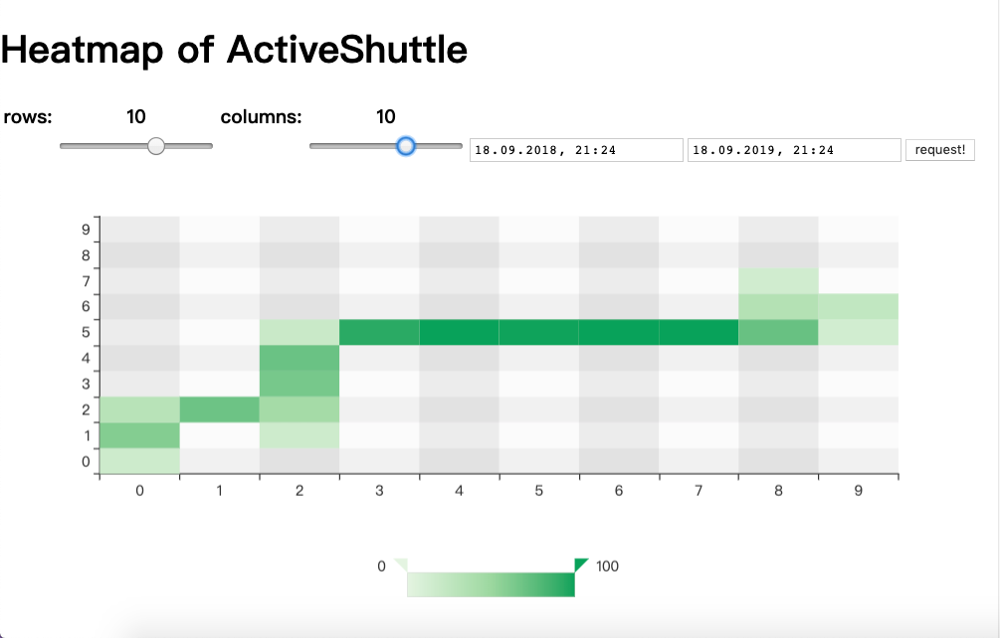
For details, please see [BatchServiceApi.md](https://gitlab.tubit.tu-berlin.de/beierle/ic4f/wikis/batchserviceapi)

### 2.3 Debugging and performace measuring

* Zipkin for latency performance
Open browser and go to http://localhost:9411 to see the latency measurement provided by Zipkin:
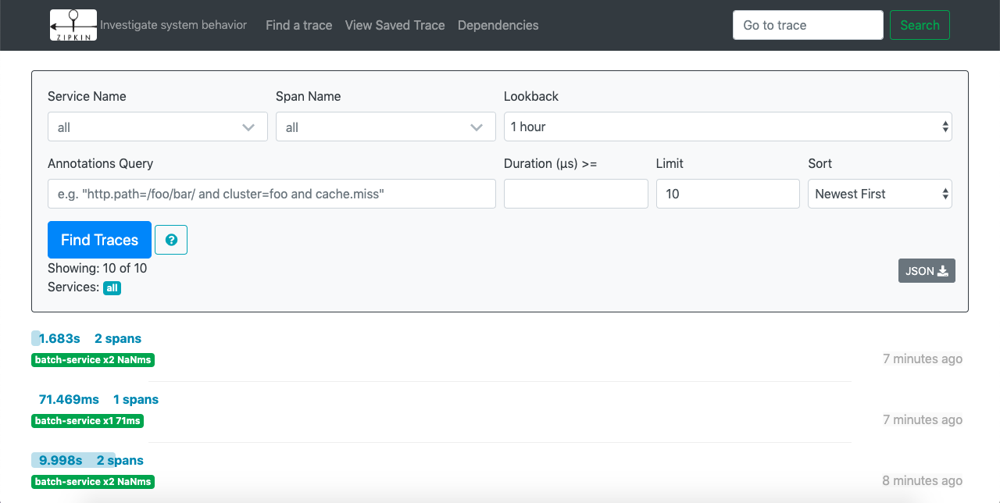

### 2.4 Check running services with Weave Scope

* Weave Scope for relation visualisation
You can also use [Weave Scope](https://github.com/weaveworks/scope) to see the relations between services.
Run these commands in the bash, then open browser and go to http://localhost:4040

    ``` bash
    sudo curl -L git.io/scope -o /usr/local/bin/scope
    sudo chmod a+x /usr/local/bin/scope
    scope launch
    ```

    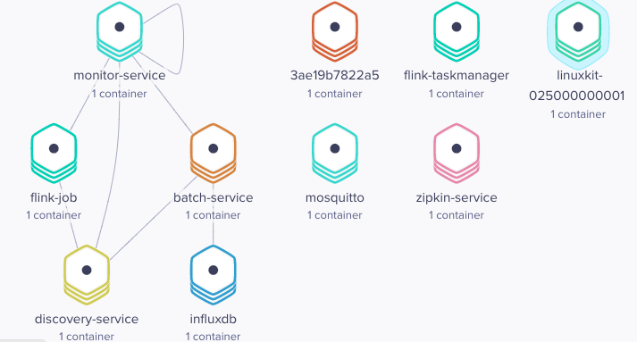

---

## 3. Module descriptions and deployment configurations

AnaLoc is intended to analyze the data points sent by autonomous vehicles in the smart factory.

This figure summarizes the developed microservice-based architecture:
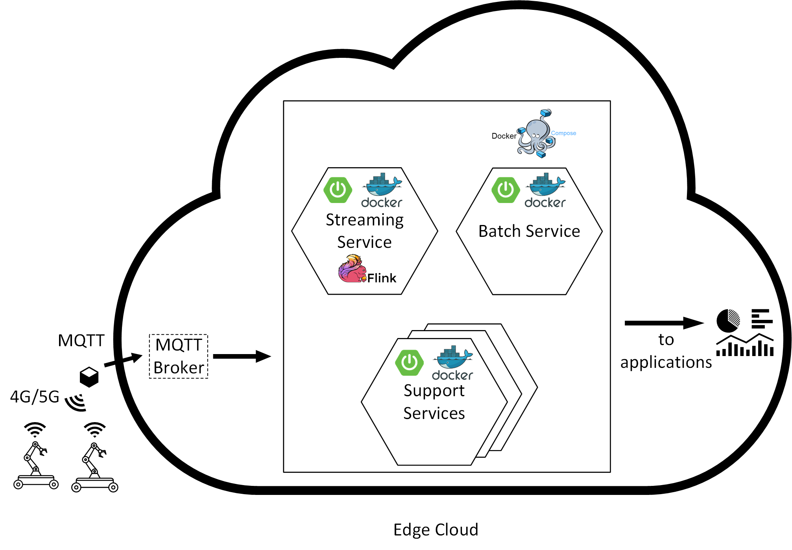

We use a micro-services architecture for the arrangement of different services. The whole project is build on Spring Boot and Apache Flink. We use `Spring Boot` for parameter configuration. Before deployment, we need to configure some configuration files, which adapts the code to the environment. The configuration files are located in corresponding sub-folders according to the different services under the folder `config`. It is also possible to set environment variable instead of using configuration file according to the [Spring Documentation](https://docs.spring.io/spring-boot/docs/current/reference/html/boot-features-external-config.html), but not recommended.

In this project, we use `docker-compose` for deployment . The related file in the project folder is named `docker-compose.yml` and is used for deploying everything.

The code contains the two core services `analysisService` for analysis of live data from a MQTT Queue and `batchService` for the analysis of historical data from an InfluxDB. There are additional support services.

### 3.1 analysisService

- **analysisService** is responsible for the location stream processing and warning sending.
- Streaming data is read from MQTT queue; endpoint is defined in  `config/core-services/analysisService/application.yml`
  - It will load the map `map.json` under this path: `/config/core-services/analysisService/json/`
  * About map loading:<br>
Given a `.dxf` file (not included here), the json map file (included) is converted using [dxf-parser](https://github.com/gdsestimating/dxf-parser). The DXF file exported via [Siemens Solid Edge 2D Drafting](https://www.plm.automation.siemens.com/plmapp/education/solid-edge/en_us/free-software/free-2d-cad) which takes the original `.dft` file.<br>
When configuring the map, for each ForbiddenZone, you need to create a new layer named `ForbiddenZone[num]`, in which `[num]` stands for a number.<br>
The borders of the map should be drawn in the `Border` layer.
  * In general, a map should look like the example figure below. Every layer should contain a closed path.
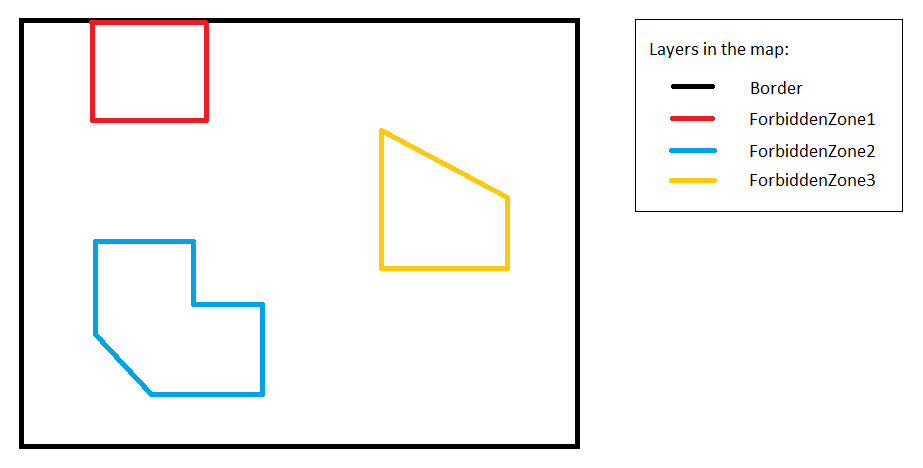

- Warnings are written to the MQTT queue when forbidden areas are entered and when the speed is below a given threshold. Multiple vehicles supported. For interface description see next section.


### 3.2 batchService

- **batchService** is responsible for the analysis of historical location data by the autonomous vehicles.
- The goal is to show in which areas which average speed the vehicles moved with.
- It will load the config file under this path, which contains the InfluxDB endpoint: `config/core-services/batchService/application.yml`
- It will process the JSON request sent to http://batchService:8222/heatmap and provide the heatmap matrix. For API description, see the next section.
- Asynchronously generates a heatmap of the average speeds of the given vehicles; multiple vehicles are supported


### 3.3 Support services

- **discoveryService** is responsible for service registration and service discovery.
- **monitorService** is used to monitor the health state of Services.
- **zipkinService** is a service for debugging, which can be used to analyze the performance of core-services.
- **scaleService** is intended to scale our services dynamically according to the load, which will work with a load balancer.

### 3.4 docker-compose and debugging services

In `docker-compose.yml` under **services** you can see the organization of microservices. There are a few services only used for debugging: `influxdb`, `mosquitto` and `zipkin-service`. For deployment in production environments, they should be removed.

The whole cluster use the same network called `backend` as a bridge.

Because of starting order, we use a simple bash script called `wait-for-it.sh` located in `core-services/analysisService/` for the services **flink-taskmanager** and **flink-job**.

For details about `wait-for-it.sh`, please see [github.com/vishnubob/wait-for-it](https://github.com/vishnubob/wait-for-it)

For details about `docker-compose.yml`, please see the [Docker Documentation](https://docs.docker.com/compose/compose-file/compose-file-v2/)

---

## 4. Interfaces

Our services take data from a MQTT queue and from an InfluxDB. The analysis results from the streaming service are available via the MQTT queue. The analysis results from the batch service are available via a REST interface.

### 4.1 Live Analytics Results (live warnings use case)

The results of the live analysis are reported to the MQTT queue. There are two types of warnings that are calculated and reported. Just subscribe to the following topics to receive the warnings.

Address:  `{mqtt queue address here}:1883`

Forbidden area warning: `/warning/area`

Low speed warning: `/warning/speed`

Forbidden area warning is created when the vehicle is entering a forbidden area, as defined in our configs. Low speed warning is created when the speed of the vehicle is below a given threshold as defined in our config.

**Open point**: The map is not correct yet. Once we receive the map, we will update our configs accordingly.

### 4.1.1 Example warnings

+ 1. Forbidden area warning:

```json
	{
		"timeStamp":"1540824931761162996",
		"vehicleId":"ActiveShuttle",
		"warningType":1,
		"warningInfo":{
			"message":"Forbidden area warning",
			"areaNo":"Out of border."
		},
		"position":{
			"x":-0.713168669800038,
			"y":0.09476577368554875
		}
	}
```

+ 2. low speed warning:

```json
	{
		"timeStamp":"1540824935883568048",
		"vehicleId":"ActiveShuttle",
		"warningType":2,
		"warningInfo":{
			"message":"Low velocity warning",
			"velocity":7.352704263061942E-6
		},
		"position":{
			"x":-0.1040771603178885,
			"y":0.04279129723766709
		}
	}
```


### 4.2 Batch API (Average Speed Heatmap use case)

Description: Request the heatmap matrix of the robots' average speed in a given resolution and given time period.

The available map is split into the number of rows and columns as provided in the query (can be any value from 1-15). The result is contains the average speed for each field of the resulting matrix.

#### Request
```
POST {url here}:8222/heatmap
```

Handles `application/json`.

|Type|Name|Description|
|---|---|---|
|**Body**|**request**  <br>*required*|Object that describe the required resolution and time range of the heatmap|

|Name|Schema|
|---|---|
|**vehicleIds**  <br>*optional*|< string > array|
|**startTime**  <br>*optional*|string (date-time)|
|**endTime**  <br>*optional*|string (date-time)|
|**rowCounts**  <br>*optional*|integer (int32) range: [1,15] |
|**colCounts**  <br>*optional*|integer (int32) range: [1,15] |


#### Response

|HTTP Code|Description|Schema|
|---|---|---|
|**200**|success|`map< string, array[ array[double] ] >`|
|**503**|time out or other errors|no content|


### 4.2.1 Example request

#### Request body
```json
{
  "vehicleIds" : [ "ActiveShuttle" ],
  "startTime" : "2018-09-18T21:24:00Z",
  "endTime" : "2019-10-01T21:24:00Z",
  "rowCounts" : 2,
  "colCounts" : 4
}
```


#### Response

##### Response 200
```json
{
  "ActiveShuttle" : [ [0.001, 3.86E-4, 0.0, 0.0],
                      [0.0, 4.92E-4, 0.001, 2.49E-4] ]
}
```
Which represents the matrix of this picture:
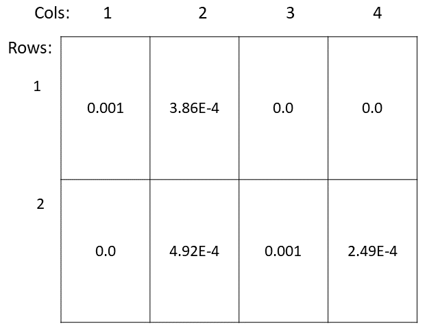
